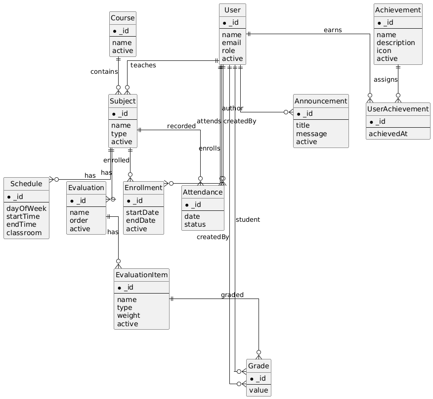
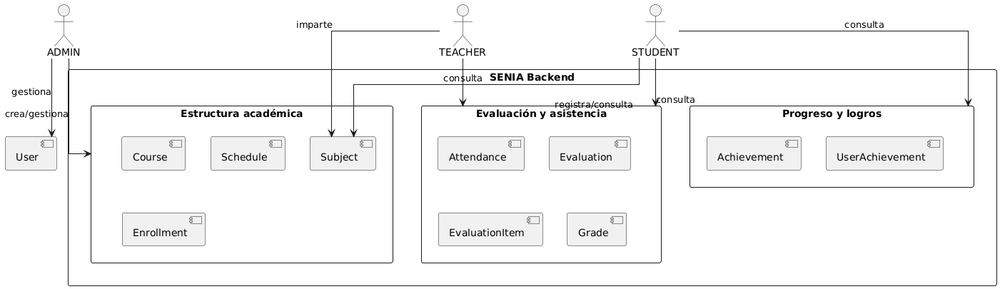
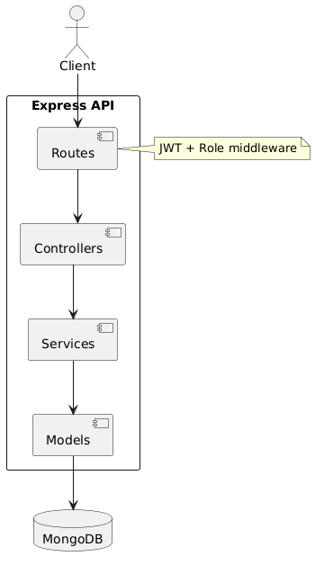
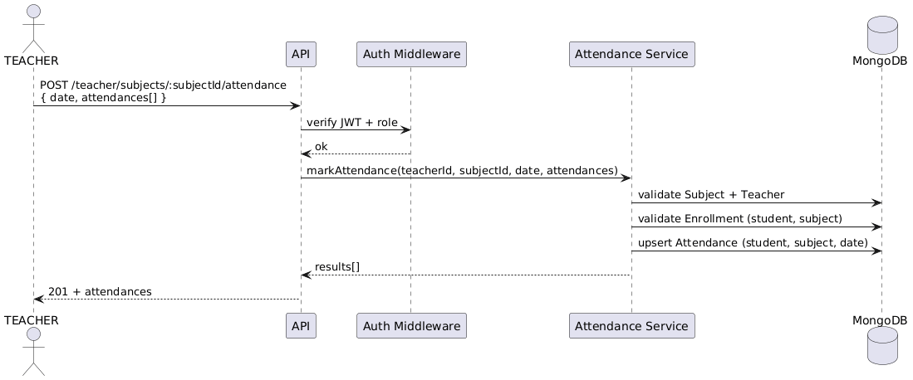

# SENIA - Backend

SENIA (Sistema Educativo de Notas, Informacion y Asistencia) es un backend que centraliza notas, asistencia y evaluaciones por asignatura. El objetivo es que la informacion academica este unificada, con control por rol y con reglas claras de quien puede crear, modificar o consultar cada dato.

**Instalacion y ejecucion local**  
Necesitas Node.js y MongoDB en local o una URI remota.

1. Crea `.env` en la raiz:
```env
PORT=3000
MONGO_URI=tu_uri_de_mongo
JWT_SECRET=tu_secreto
```
2. Instala dependencias:
```bash
npm install
```
3. Arranca el servidor:
```bash
npm start
```

**Arquitectura**  
API REST en Express con Mongoose. La logica esta separada por capas para mantener el codigo ordenado:  
`routes -> controllers -> services -> models`.  
El acceso se valida con JWT y se restringe por rol en cada ruta.

**Roles**  
Resumen directo de responsabilidad por rol:
- `ADMIN`: crea estructura academica, usuarios y matriculas.
- `TEACHER`: gestiona asistencia, evaluaciones e items de evaluacion.
- `STUDENT`: consulta su progreso, asistencia y notas.

**Swagger**  
La documentacion OpenAPI esta disponible en:

Local:
```text
http://localhost:3000/api-docs
http://localhost:3000/api-docs.json
```

Desplegado (Render):
```text
https://bartlomiejkrzysztofchudy-dwes-1.onrender.com/api-docs/
```

**Futuras implementaciones**  
Pendiente completar modulos administrativos de logros, anuncios

---

## Docker (local)

Requisitos: Docker Desktop y Docker Compose.

**Levantar servicios**
```bash
docker compose up -d
```

**Ver logs**
```bash
docker compose logs -f api
```

**Parar servicios**
```bash
docker compose down
```

Swagger disponible en:
```text
http://localhost:3000/api-docs
```

Para mas detalle ver `DOCKER.md`.

---

## Tests y calidad

**Tests**
```bash
npm test
```

**Cobertura**
```bash
npm run test:coverage
```

**SonarQube (local)**
```bash
npm run sonar:local
```

**SonarQube (Docker)**
```bash
npm run sonar:docker
```

---

## Relacion por roles y modelos

Esta seccion explica como se conectan los roles con los modelos principales. La idea es que cada rol actue solo sobre la parte que le corresponde.

**ADMIN**  
Define la base del sistema y mantiene la estructura:
- Crea cursos y asignaturas: `Course`, `Subject`.
- Configura horarios: `Schedule`.
- Matricula alumnos: `Enrollment`.
- Gestiona usuarios: `User`.
- (Pendiente) Gestion de logros y anuncios: `Achievement`, `Announcement`.

**TEACHER**  
Trabaja sobre sus propias asignaturas (`Subject.teacher`):
- Registra asistencia: `Attendance`.
- Crea evaluaciones e items: `Evaluation`, `EvaluationItem`.
- Pone calificaciones: `Grade`.

**STUDENT**  
Consume su informacion personal:
- Ve asignaturas matriculadas: `Enrollment`.
- Consulta asistencia: `Attendance`.
- Consulta notas por evaluacion: `Grade`.
- Consulta logros si existen: `Achievement`, `UserAchievement`.

**Relaciones clave**
- `User (STUDENT)` <-> `Subject` por `Enrollment`.
- `Subject` <-> `Schedule` (por dia).
- `Subject` <-> `Evaluation` <-> `EvaluationItem` <-> `Grade`.
- `User (STUDENT)` <-> `Attendance`.
- `User` <-> `Achievement` por `UserAchievement`.

---

## Diagramas

### Modelo ER


### Flujo por rol


### Arquitectura


### Secuencia de asistencia

